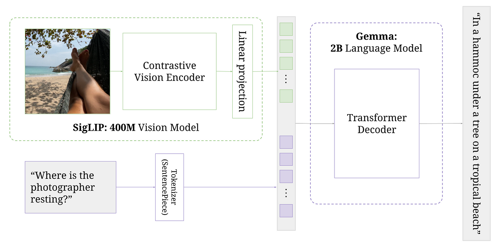

# PaliGemma

[PaliGemma: A versatile 3B VLM for transfer](https://arxiv.org/abs/2407.07726) PyTorch implementation based on [Umar Jamil's Coding a Multimodal (Vision) Language Model from scratch in PyTorch with full explanation](https://www.youtube.com/watch?v=vAmKB7iPkWw&t=40s).



## Getting Started

To set up and run this project:

- Create a new environment with the provided `requirements.txt` file:
  ```bash
  virtualenv venv
  source venv/bin/activate
  pip3 install -r requirements.txt

- Run inference:
```bash
bash launch_inference.sh
```

## TODO:
- Implement a `Streamlit/Gradio` interface for interacting with the model
- Fix an issue with generating tokens for model
- Add `requirements` file